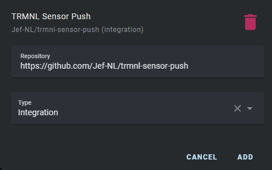
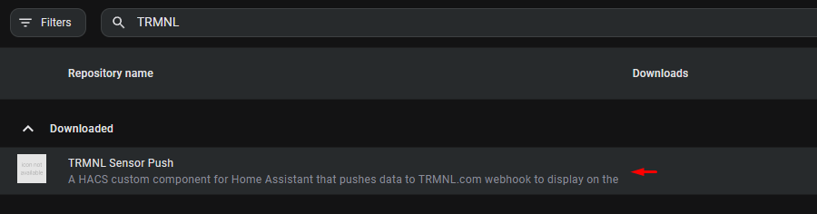
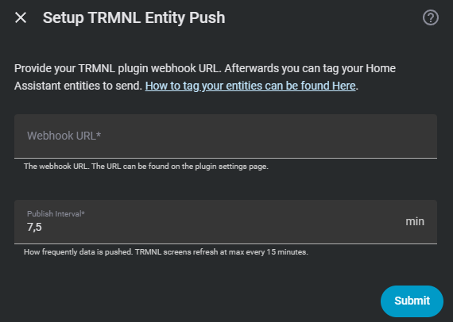
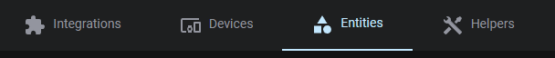
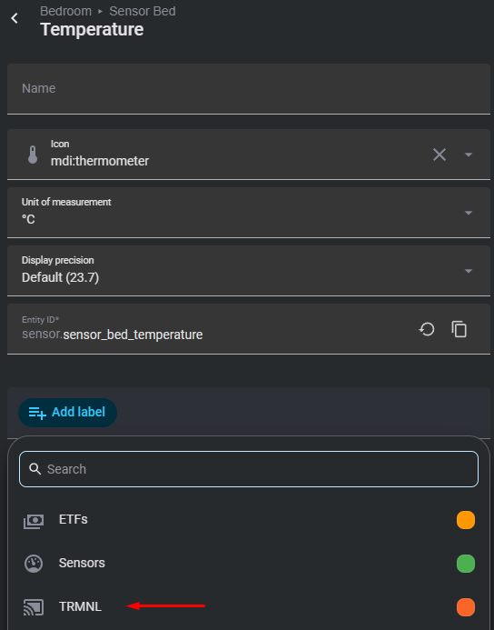

# TRMNL Sensor Push for Home Assistant

> **Push your Home Assistant entity states directly to your TRMNL display, privately, securely, and without any complex network setup.**


---

## ✨ What Is This?

**TRMNL Sensor Push** is a Home Assistant integration that periodically sends your selected entity states to your [TRMNL](https://trmnl.com) device. It's designed to work seamlessly with the **[Home Assistant Entity Cards \[Webhook\] Plugin](https://trmnl.com/recipes/324788)**, a beautifully simple way to display live sensor data, temperatures, lights, or anything else on your TRMNL e-ink screen.

[![Home Assistant Entity Cards [Webhook]](./doc/icon.png)](https://trmnl.com/recipes/324788)

### 🔒 Privacy First, No Port Forwarding Required

Unlike polling-based setups, this integration uses a **push (webhook) strategy**: your Home Assistant sends data *outward* to TRMNL, TRMNL never connects back to your home network. This means:

- ✅ No port forwarding
- ✅ No DNS configuration
- ✅ No exposure of your private Home Assistant instance
- ✅ Encrypted via HTTPS (TLS), just like visiting a website

Think of it like your browser loading a webpage: you reach out to the server, but the server cannot reach back into your home.

> 🔄 **Prefer polling over push?** Check out the polling-based [Home Assistant Entity Cards Plugin](https://trmnl.com/recipes/286869) instead.

---

## 🚀 Installation

### Option A, HACS (Recommended)

1. Open HACS and add this repository as a **[Custom Repository](https://www.hacs.xyz/docs/faq/custom_repositories/)**:
   ```
   https://github.com/Jef-NL/trmnl-sensor-push
   ```
   

2. [Download the integration](https://www.hacs.xyz/docs/use/repositories/dashboard/#downloading-a-repository) through HACS.

   

3. **Restart Home Assistant.**

---

### Option B, Manual Installation

1. Copy the `custom_components/trmnl_sensor_push` folder into your Home Assistant `custom_components` directory.
2. **Restart Home Assistant.**

---

## ⚙️ Configuration

### Step 1, Add the Integration

1. Go to [**Configuration → Integrations**](http://homeassistant.local:8123/config/integrations/dashboard).
2. Click **+ Add Integration** and search for **"TRMNL Entity Push"**.
3. Fill in the configuration form:

   

| Setting | Description |
|---|---|
| **Webhook URL** | Found on your TRMNL plugin settings page. Looks like: `https://trmnl.com/api/custom_plugins/xxxx-xxx-xxx-xxxxx` |
| **Publish Interval** | How often data is pushed, between **7.5 minutes** and **12 hours** |

> **ℹ️ Why a 7.5-minute minimum?**
> TRMNL's webhook is rate-limited to **120 pushes per hour per account**. Since the screen itself refreshes at most every 15 minutes, 7.5 minutes is a sensible sweet spot, frequent enough for timely updates, safe enough to avoid hitting rate limits even after a Home Assistant restart.

---

### Step 2, Tag Your Entities

The integration works by sending any entity you've labelled with the `TRMNL` label in Home Assistant. Here's how to set that up:

1. Open [**Settings → Entities**](http://homeassistant.local:8123/config/entities) and find the entity you'd like to display.

   

2. Assign it the **`TRMNL` label** (automatically created by the integration on first run).

   

3. **That's it!** Wait for the next publish interval and your data will appear in your TRMNL plugin.

---

## 🛠️ Troubleshooting

If something isn't working, check **Home Assistant → Logs** for error messages. Here are the most common issues:

| Problem | Solution |
|---|---|
| **Invalid Webhook URL** | Double-check your TRMNL plugin page. Make sure the full URL is copied, including `https://` |
| **Rate limiting** | You're sending more than 120 messages/hour. If you use multiple webhook URLs, add up your total push rate |
| **Integration not active** | HACS installs it, but make sure it's also enabled in Home Assistant's integration list |
| **No data showing** | Ensure at least one entity has the `TRMNL` label. If you deleted the label, restart HA, it'll be recreated automatically |
| **Network errors** | Temporary connectivity issues can happen. Go for a walk, it may resolves on its own 😄 |

---

## 📄 License

Released under the [MIT License](/LICENSE), free to use, modify, and share.

---

## 🙏 Credits

This is a fork of [gitstua/trmnl-sensor-push](https://github.com/gitstua/trmnl-sensor-push), disconnected to avoid interfering with any existing plugins built on the original.

A huge thank you to **[gitstua](https://github.com/gitstua/)** for the foundational work! 🎉
